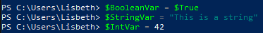
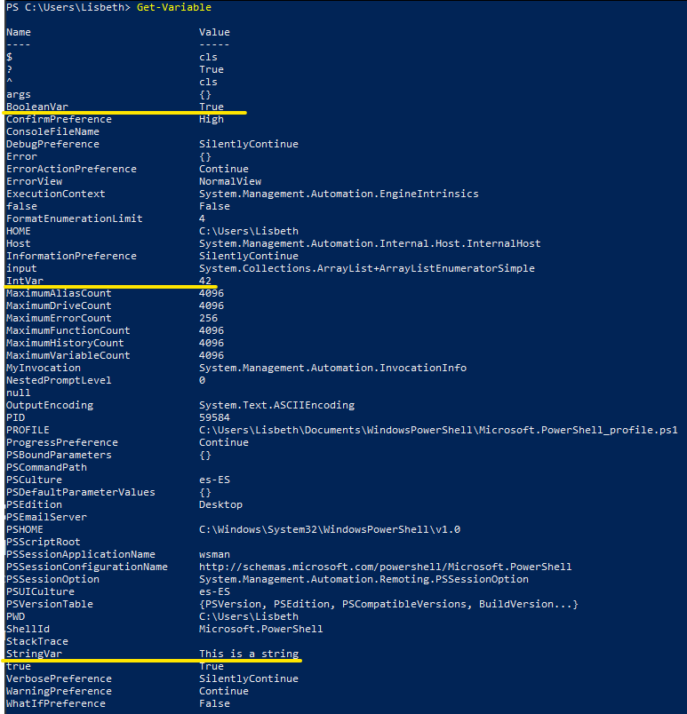
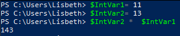
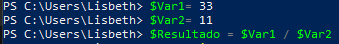
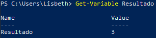
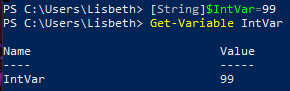
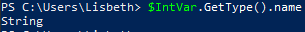

# 💻***Operadores de comparación y variables***

## **Tarea 1**

**Asigne una variable con cada tipo de datos cubierto en el taller anterior.**

Una variable es una unidad de memoria en la que se almacenan los valores. En PowerShell, las variables se representan mediante cadenas de texto que comienzan por un signo de dólar ($).

```powershell
PS C:\Users\Lisbeth> $BooleanVar = $True
PS C:\Users\Lisbeth> $StringVar = "This is a string"
PS C:\Users\Lisbeth> $IntVar = 42
```



---

## **Tarea 2**

**Enumere todas las variables actualmente cargadas en la memoria.**

```powershell
PS C:\Users\Lisbeth> Get-Variable
```

Estas son las viariables del sistema (he subrayada las creadas en el ejercicio anterior):



---

## **Tarea 3**

**Múltiplique dos variables Int juntas.**

```powershell
PS C:\Users\Lisbeth> $IntVar1= 11
PS C:\Users\Lisbeth> $IntVar2= 13
PS C:\Users\Lisbeth> $IntVar2 *  $IntVar1
```



---

## **Tarea 4**

**Primero declare dos variables Int. Luego divida la primera variable por la segunda y asigne el resultado a una variable llamada $VariableResult.**

```powershell
PS C:\Users\Lisbeth> $Var1= 33
PS C:\Users\Lisbeth> $Var2= 11
PS C:\Users\Lisbeth> $Resultado = $Var1 / $Var2
```



Después podemos ver el valor de la variable con `Get-Variable Resultado` , obteniendo lo siguiente:



---

## **Tarea 5**

```powershell
PS C:\Users\Lisbeth> [String]$IntVar=99
```

Después realizamos un `Get-Variable` para ver el contenido de dicha:



O podemos utilizar el siguiente método para visualizar el tipo de vatiable:

```powershell
PS C:\Users\Lisbeth> $IntVar.GetType().name
```

Obteniendo lo siguiente: 

